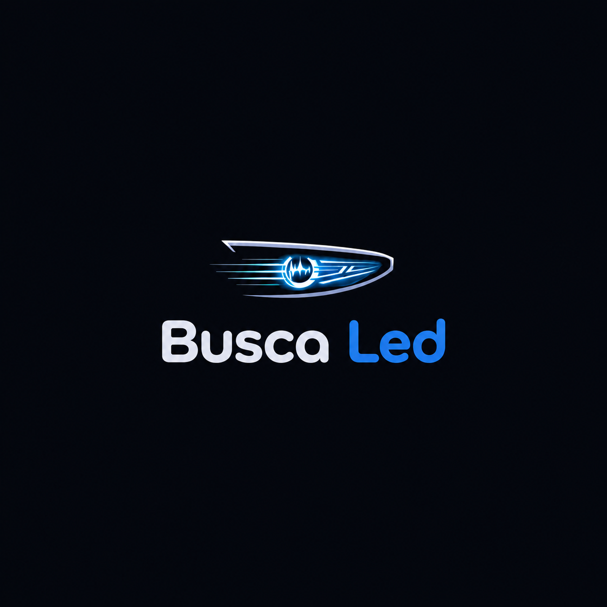

# BuscaLED



[](https://github.com/Vytor-Oliveira/BuscaLed/actions/workflows/ci.yml)
[](https://sonarcloud.io/summary/new_code?id=Vytor-Oliveira_BuscaLed)
[](https://sonarcloud.io/summary/new_code?id=Vytor-Oliveira_BuscaLed)

Motor de Compatibilidade e Orquestração de Pedidos para Iluminação Automotiva LED.

> Garagem Virtual · Controle de Estoque · Edição de Ticket · Acompanhamento de Pedidos

> Projeto de Portfólio — Engenharia de Software, Católica SC.
> RFC completa: a ser publicada em `/docs/RFC.pdf` assim que disponível.

## Sobre o projeto

O mercado de iluminação automotiva LED no Brasil movimenta um volume crescente de
vendas, especialmente no segmento de retrofit. Representantes comerciais — como o
parceiro deste projeto, a marca **Shocklight** — respondem manualmente no WhatsApp
qual LED serve em cada veículo, consultando tabelas em PDF que ficam desatualizadas
e não escalam.

O **BuscaLED** resolve isso cruzando os dados de um veículo (por placa ou manualmente)
com a matriz de compatibilidade de LEDs automotivos da Shocklight, retornando todos os
modelos compatíveis por posição de farol (farol baixo, alto, neblina, lanterna), cada uma
podendo ter múltiplos modelos disponíveis (S14, S14X, S16, S17, S17X, Ultraled Infinity,
entre outros). O cliente final gera um ticket de reserva consolidado e acompanha seu
pedido; o representante comercial gerencia pedidos, edita produtos, controla estoque e
contata o cliente via WhatsApp direto do painel — tudo com **Privacy by Design** (a placa
do veículo nunca é persistida em nenhuma camada de dados).

## Público-alvo

| Perfil | Descrição |
|---|---|
| **Cliente Final** | Motorista sem conhecimento técnico. Salva veículos na Garagem Virtual, visualiza LEDs compatíveis por posição e modelo, gera pedido consolidado e acompanha o status em Meus Pedidos. |
| **Representante Comercial (Parceiro)** | Recebe notificação de novos tickets, gerencia a fila de pedidos, edita produtos do ticket com notificação automática ao cliente, contata o cliente via WhatsApp e monitora métricas de demanda. |
| **Administrador do Sistema** | Mantém a matriz de compatibilidade por posição de farol, gerencia o estoque por produto (quantidade e nível mínimo de alerta) e gerencia usuários administrativos. |

## Funcionalidades principais

- Cadastro com e-mail/senha ou login social (Google OAuth2)
- Garagem Virtual: busca de veículo por placa (via apiplacas.com.br) ou Marca/Modelo/Ano manual
- Motor de compatibilidade multi-posição e multi-modelo, com estoque disponível por modelo
- Geração de ticket de reserva consolidado, com notificação por e-mail ao representante
- Tela "Meus Pedidos" para o cliente acompanhar e cancelar pedidos em aberto
- Edição de produto no ticket pelo representante (mesmo encaixe), com notificação ao cliente
- Botão de contato direto via WhatsApp do representante para o cliente
- Painel administrativo: fila de tickets, controle de estoque por produto e dashboard de inteligência de demanda

## Fora do escopo (v1)

- Processamento de pagamentos ou gateway financeiro
- Emissão de notas fiscais
- Aplicativo mobile nativo (iOS/Android)
- Integração com múltiplos representantes ou multitenancy
- Rastreamento de entregas ou logística pós-pedido
- Envio de mensagens automáticas via WhatsApp Business API

## Stack

| Camada | Tecnologia | Justificativa |
|---|---|---|
| Frontend | React + Vite | SPA adequado para o MVP acadêmico |
| Backend | Node.js + Express | Eficiência em operações I/O-bound (apiplacas.com.br, banco) |
| ORM | Prisma | Type-safe, migrations e queries parametrizadas (proteção contra SQL Injection) |
| Banco de dados | PostgreSQL (Azure Database for PostgreSQL) | Relacional, adequado para a matriz multi-modelo e queries analíticas |
| Fila de tarefas | Redis + Bull | Processamento assíncrono de e-mails sem bloquear o fluxo do usuário |
| E-mail transacional | SendGrid / Nodemailer | Notificações de ticket, edição e cancelamento |
| Autenticação | JWT + Google OAuth2 | Sessão stateless para SPA + API REST; login social como diferencial |
| CI/CD | GitHub Actions | Automação de testes, análise estática e build |
| Análise estática | SonarCloud | Gratuito para repositório público durante o TCC |
| Observabilidade | New Relic | Monitoramento de performance, disponibilidade e alertas de estoque mínimo |
| Containerização | Docker | Padroniza o ambiente local e simplifica o deploy |

## Arquitetura

Arquitetura de três camadas (frontend SPA, backend API REST e banco relacional), com
serviços auxiliares para autenticação OAuth2, fila de notificação e integração com
apiplacas.com.br. Decisões arquiteturais centrais: (1) Privacy by Design — a placa nunca
é gravada; (2) pedidos multi-item via `ticket_items` com rastreamento de edições;
(3) controle de estoque com decremento apenas ao concluir o ticket.

```
Cliente Final / Representante (navegador)
        │  HTTPS
        ▼
Frontend (React + Vite) ── requisições REST ──▶ Backend API (Node.js + Express)
                                                        │
                        ┌───────────────────────────────┼───────────────────────────────┐
                        ▼                               ▼                               ▼
              PostgreSQL (Azure)              Fila Bull / Redis              Serviços externos
        usuários, veículos, produtos,     processa e-mails de forma      apiplacas.com.br (placa)
     tickets e histórico — sem placa           assíncrona                Google OAuth2 (login)
                                                                          SendGrid (e-mail)
                                                                          New Relic (observabilidade)
```

## Modelo de dados (resumo)

| Entidade | Responsabilidade |
|---|---|
| `users` | Clientes, representantes e admins |
| `vehicles` | Veículos salvos na Garagem Virtual — sem coluna de placa (Privacy by Design) |
| `products` | Produtos LED com `stock_quantity` e `stock_min_alert` |
| `compatibility_matrix` | Matriz De-Para: modelo/ano de veículo × posição de farol × produto |
| `tickets` / `ticket_items` | Pedido consolidado e seus itens; registra produto original e substituto quando editado |
| `search_history` | Histórico analítico de buscas — sem dados de placa |

## Regras de negócio principais

- A placa do veículo não é armazenada em nenhuma tabela, log ou cache (RN02)
- O ticket de reserva não constitui venda confirmada nem obrigação financeira (RN04)
- O estoque só é decrementado quando o representante marca o ticket como Concluído (RN12)
- A substituição de produto pelo representante deve respeitar o mesmo tipo de encaixe (RN11)
- O cliente só pode cancelar o próprio pedido enquanto o status for Novo ou Em Atendimento (RN14)
- Apenas usuários Admin podem alterar a matriz de compatibilidade e o estoque (RN06)

## Metas de qualidade (KPIs)

| Indicador | Meta |
|---|---|
| Tempo de consulta (placa → resultado) | Inferior a 3 segundos |
| Disponibilidade da aplicação | Uptime mínimo de 99% |
| Timeout da apiplacas.com.br | Máximo 5s, com fallback automático para busca manual |
| Cobertura de testes — Backend / Frontend | Mínimo 75% / 25% |
| Notificações por e-mail (ticket, edição, cancelamento) | Enviadas em até 60 segundos |

## Planejamento (marcos da RFC)

| Marco | Entrega |
|---|---|
| M0 — RFC Aprovada | Documento aprovado pelo comitê |
| M1 — Setup e PoC | Repositório, CI/CD, SonarCloud, infra Azure, PoC apiplacas.com.br |
| M2 — Auth e Garagem | Cadastro, login social e Garagem Virtual funcionais |
| M3 — Motor e Estoque | Motor multi-posição e catálogo com estoque funcional |
| M4 — Tickets e Notificações | Ticket multi-item, edição e cancelamento com notificação |
| M5 — Painel Gerencial | Fila de tickets, WhatsApp, catálogo e dashboard |
| M6 — Testes e Qualidade | Cobertura de testes e Quality Gate do SonarCloud aprovados |
| M7 — Deploy e Entrega | URL pública funcional e validação documentada com o parceiro |

## Estrutura do repositório

```
.
├── backend/          # API REST (Node.js + Express)
├── frontend/          # SPA (React + Vite)
├── docs/              # RFC, diagramas C4, modelo de dados
├── .github/
│   ├── workflows/     # Pipelines de CI/CD
│   ├── ISSUE_TEMPLATE/
│   └── PULL_REQUEST_TEMPLATE.md
├── docker-compose.yml
├── sonar-project.properties
└── CONTRIBUTING.md    # Fluxo de Code Review / Peer Review (PAC VIII)
```

## Rodando localmente

```bash
# Backend
cd backend
cp .env.example .env
npm install
npm run dev

# Frontend
cd frontend
npm install
npm run dev

# Infra local (Postgres + Redis)
docker compose up -d
```

## Testes e cobertura

Metas definidas na RFC (RNF05): **75% backend / 25% frontend**.

```bash
cd backend && npm run test:cov
cd frontend && npm run test:cov
```

## Squad de Validação (PAC Extensionista VIII)

Este repositório segue o fluxo de **Code Review obrigatório** descrito em
[`CONTRIBUTING.md`](./CONTRIBUTING.md): nenhum merge é feito na `main` sem ao menos
uma aprovação de um integrante do squad.

## Parceiro Externo

Projeto validado com o representante comercial da marca **Shocklight** (Santa Catarina).

## Informações acadêmicas

| | |
|---|---|
| **Curso** | Engenharia de Software |
| **Instituição** | Católica SC |
| **Autor** | Vytor Oliveira |
| **Orientador** | Diogo Vinícius Winck |
| **Ano** | 2026 |

## Licença

Este projeto é acadêmico (TCC/Portfólio — Católica SC). Ver [`LICENSE`](./LICENSE).
